# SDIO
## Notes
**The SDIO-NETLINK interface is currently experimental and may not be fully stable. Its behavior is subject to change as it undergoes further development and refinement.**

**No Backward Compatibility Guarantee: If you choose to integrate this interface into your system, note that future updates or versions may not maintain compatibility with the current implementation.**

## Overview
CPCd, running in userspace, communicates with the SDIO peripheral in kernel space through a socket interface. The Linux SDIO driver must be loaded to expose the socket required by CPCd.



## SDIO Reset Sequence & CPCd Configuration


The NETLINK-SDIO interface requires adding the configuration `reset_sequence: false` in the CPCd configuration file. This setting bypasses the hardware reset typically performed by CPCd.

By default, when CPCd starts, it requests the device to perform a hard reset to ensure it is in a clean state. However, with SDIO, performing such a reset is not feasible because the SDIO device and the Linux SDIO driver would need to be unloaded and reloaded. This process causes issues for CPCd, which attempts to maintain an active connection.

As a result, CPCd has a limitation when using SDIO: it cannot perform a hard reset between each CPCd stop and start. Resetting the device must instead be managed by the system itself.

## Linux SDIO Driver

Prerequisite: The [Linux-NETLINK-SDIO-Driver](https://github.com/SiliconLabs/linux-sdio-driver) must be compiled and installed onto your Linux system.
NETLINK-SDIO interface requires a kernel driver to be loaded to expose the SDIO interface to the userspace throught a socket.

### Installation Steps:

1. Clone the Repository : 

```git clone https://github.com/SiliconLabs/linux-sdio-driver.git```

2. Navigate to below Directory: 

```cd linux-sdio-driver/platforms/linux/Driver/sdio/src```

3. On the target machine where the driver will be installed, compile the SDIO driver using the following commands:

```make```

If the driver will be loaded onto a different machine, please consult the Linux Foundation documentation for instructions on how to cross-compile a driver.

4. Insert Driver Module: Once the driver (rpssdio.ko) is built successfully, insert it into the kernel using insmod: 

```
insmod rpssdio.ko
```

5. Clear Kernel Messages (Optional) : This clears the kernel log buffer and allows you to view onlt the latest logs generated after loading the module 

```
dmesg -c
```


