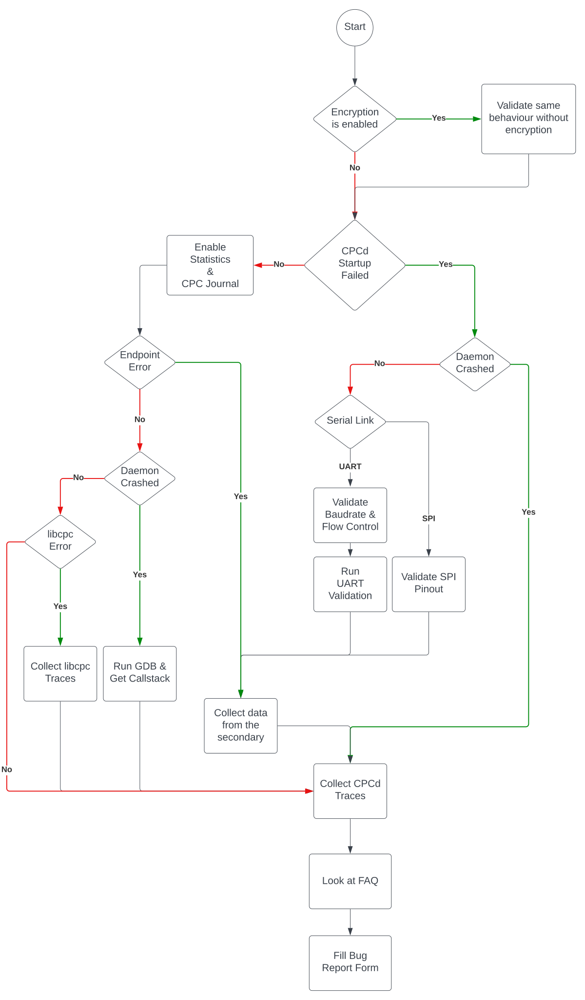
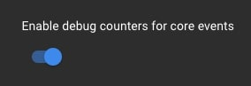
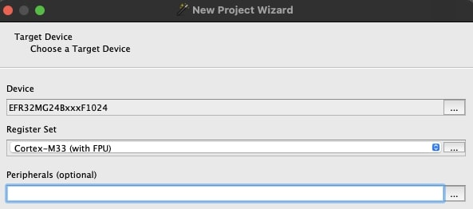
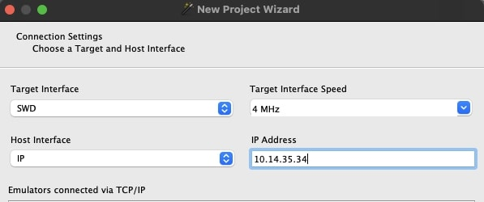
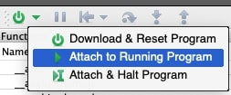
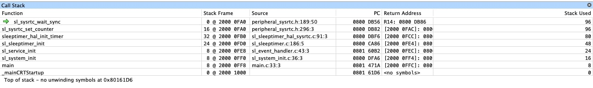
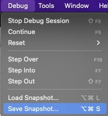
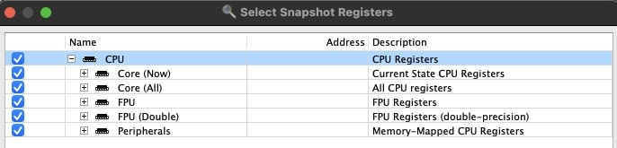

# Troubleshooting
Co-processor Communication (CPC) is a multi-component system.
Refer to [CPC Overview](overview.md) to have a better understanding of each component.

The following flowchart is provided to help with the troubleshooting process.
At each decision point, there are specific actions or validations to be undertaken.
The goal is to pinpoint the source of problems within the CPC system and gather
necessary diagnostic information for resolution.




## Statistics
Statistics can be printed to the standard output using the `--print-stats <interval>` argument.
Provide the interval, in seconds, as a parameter.

Provide the resulting `Host core debug counters` and ` RCP core debug counters` printed to the console in your bug report.

The secondary must have `SL_CPC_DEBUG_CORE_EVENT_COUNTERS` enabled.
This can be done with the following configuration in the Secondary Device (Co-Processor) component:
<br>

## CPCd Traces
Traces are additional logs about the daemon events.
The traces can be enabled in the CPCd configuration file.

#### stdout Tracing
When the `stdout_trace` option is enabled, traces will be shown on the standard output.

#### File Tracing
Traces can be saved to a file when the `trace_to_file` option is enabled.
The target folder is specified with the `trace_folder` option.
To minimize performance impact, save files to volatile storage.

#### Frame Tracing
If the issue is reproduced fairly quickly, the `enable_frame_trace` configuration
can be used to enable an additional level of information to the traces.

## Encryption Validation: Validate same behavior without encryption.
Refer to the [Security](security.md) section for more information.

## UART Validation.
If the physical transport is UART, run the following validations:

CPCd offers two test modes to validate the physical UART link:

````
cpcd -t/--uart-validation <test>
provide test option to run: 1 -> RX/TX, 2 -> RTS/CTS.
````

Test mode 1 will validate the RX and TX lines while test mode 2 will also validate the hardware flow control lines.

If using the VCOM port of a Wireless Starter Kit (WSTK), it can be connected via Ethernet and validated using:

````
cpcd -w <WSTK IP Address>
````

Expected result:

````
Driver : Fetching Board Controller (11.0.0.1) configuration...
Driver : SUCCESS : Host (Baudrate: 921600, Flow control: True), Board Controller (Baudrate: 923076, Flow control: True)
````

*Note: when hardware flow control is enabled, the WSTK must be configured with rtscts*


## SPI Interface Verification
Refer to the [SPI](spi.md) section for more information.

## libCPC Traces
`libcpc` is traced with a runtime argument to the `cpc_init` function.
Traces are then sent over `stderr` with the associated timestamp.

## Debugging CPCd with GDB
First, add debug symbols to the CPCd binary by specifying the `debug` target group:
```
mkdir build
cmake ../ -DTARGET_GROUP=debug
make
```

You can either start CPCd with `gdb`:
```
gdb --args cpcd -c /etc/cpcd.conf
```

Or attach to a running instance of CPCd:
```
gdb --pid <cpcd process id>
```

If the application needs to be interrupted, use `SIGSTOP` (CTRL+Z) within `gdb`.
The callstack can then be obtained using the `backtrace full` command.


## Collect data from the secondary.
In this guide we will be demonstrating how to obtain crucial information from the secondary using [SEGGER Ozone](https://www.segger.com/products/development-tools/ozone-j-link-debugger/).

1. Create a new project and specify the `Device`
<br>
2. Connect to the WSTK by providing an IP address or via USB and
choose the SWD target interface
<br>
3. Choose the `.out` or `.axf` binary of the secondary.
4. Attach to running program
<br>
5. Pause the program and take a screenshot of the callstack
<br>
6. Take a snapshot of the program under `Debug -> Save Snapshot`
<br>
7. Make sure `Registers` are all selected
<br>

8. Send the binary, screenshot of the callstack and the `.jsnap`file


### FAQ Reference and additional checks
Refer to the following [article](https://community.silabs.com/s/article/Common-CPCD-Issues-Debugging?language=en_US) for common issues with CPCd.


- When running UART, run the `cpcd -t2` validation mode to validate the connection
- When using VCOM, run `dmesg` to check if there is any USB disconnection that occured
- Validate the UART link integrity using a tool such as [linux-serial-test](https://github.com/cbrake/linux-serial-test). <br> A loopback test can be executed using `linux-serial-test -ske -p <device> -b <baudrate>`

## Bug Report Form

Provide the following details:

#### Basic Information:

* **Description of the Issue**
* **Expected Behavior**: What you expected to happen.
* **Actual Behavior**: What actually happened.

#### Environment:

* **CPCd Version**: Specify the version of the CPCd you are using.
* **Operating System & Version**: e.g., Raspbian, Ubuntu
* **Hardware Information**: Details about the primary and secondary processors involved.
* **Secondary Version**: The version of the GSDK release being used
* **CPCd Compilation**:
  * Compiler: [Name, Version]
* **Secondary Compilation**:
  * Compiler: [Name, Version,  Optimization Level]
* **CPCd Configuration**: Provide the CPCd configuration file

#### Reproduction:

* **Step-by-step Guide**: Detailed steps to reproduce the bug.
If possible, provide the code to reproduce the issue.
* **Frequency of Occurrence**: How often / after hot much time does this issue occur?
