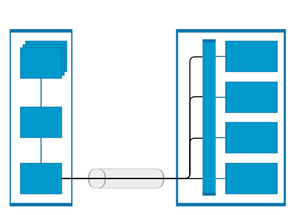

# Co-Processor Communication Daemon (CPCd)
## Overview
The Co-Processor Daemon (CPCd) enables users to have multiple stack protocols
interact with a secondary processor over a shared physical link using multiple
endpoints.

CPCD is distributed as three components: the daemon binary `cpcd`, a library
that enables `C` applications to interact with the daemon, and a configuration
file.

In CPC, data transfers between processors are segmented in sequential packets.
Transfers are guaranteed to be error-free and sent in order.

Multiple applications can send or receive on the same endpoint without worrying
about collisions.

A library `libcpc.so` is provided to simplify the interaction between the user
application and the daemon. Each API function of the library are documented in
the `sl_cpc.h` header file. Bindings for libcpc are also provided in Python and
Rust with an API that may or may not change at a later time. See `doc/python.md`
and `doc/rust.md`.



## CPCd Dependencies
CPCd is delivered as a [CMake](https://cmake.org) project. The minimum version
of CMake required to generate the project is `3.10`.

CPCd requires MbedTLS to encrypt the endpoints. The minimal MbedTLS version
required is 2.7.0. `libmbedtls-dev` must be installed to compile from sources.
With the APT package manager, use the command:
`sudo apt-get install libmbedtls-dev`

For development purposes, encryption can be disabled by providing
`ENABLE_ENCRYPTION=FALSE`
`cmake ../ -DENABLE_ENCRYPTION=FALSE`

## Compiling CPCd

Run the following commands

```
git clone https://github.com/SiliconLabs/cpc_daemon.git
cd cpc_daemon
mkdir build
cd build
cmake ../
make
```

## Installing CPCD and CPC library
To install the daemon, library, and configuration file, run:
```
sudo make install
sudo ldconfig
```

## Configuring and running CPCD
A configuration file must be provided to the CPC daemon. If the configuration
file is not specified as a command-line argument, CPC uses the default
configuration file which should be located under `/usr/local/etc/cpcd.conf`.
Note that the default location can be different, see `CMAKE_INSTALL_SYSCONFDIR`
for further information about the GNU standard installation directories.

The configuration file can be specified by providing
the `--conf` argument to `cpcd`.

```
cpcd --conf <configuration file path>
```

A description of each configuration can be found in `cpcd.conf`.

## Considerations
- The SPI driver uses a `sysfs` class GPIO as a chip select. Make sure the
  daemon has the proper permissions
- When reading, the user must provide a buffer big enough to receive the
  entire packet
- Tracing can be enabled in the daemon configuration file or when calling the
  lib `cpc_init`

## Encrypted Serial link

The host and and the secondary encrypt their messages via a session key.
A session key is generated each time the host connects to the secondary.
The session key is derived from a binding key and two random numbers.
In order to communicate with encryption enabled, the first step is to update
the configuration files with the correct values and to bind the primary
and the secondary.

### Configuration
First, the security feature must be enabled on the Host (CPCd)
and on the secondary.
- On the host, in cpcd.conf, `disable_encryption` must be set to `false`.
- On the secondary, make sure `cpc security` is installed and
  enable the security (`SL_CPC_SECURITY_ENABLED`) and select the binding method
  (`SL_CPC_SECURITY_BINDING_KEY_METHOD`); see the Binding section
  for further details.

### Binding
The binding process allow sharing a symetric key between the Host and
the Secondary. Three methods exist:
- Plain text: The host send the binding key in plain text via the serial link
  to the Secondary; cpcd `--bind` option can be used with this bind option.
- ECDH (Recommended): Generates key from an an anonymous key agreement scheme.
  It establishes a shared secret (binding key) over insecure link;
  cpcd bind feature can be used with this bind option.
- Custom: The host doesn't send the binding at all. The application only returns
  a binding key to CPC secondary. The key must be also known/used by the
  Host/CPCd. This option is not supported by cpcd `--bind` option;
  the binding key can only be set in the config file.

To bind, the daemon must be launched with the `–-bind` option. This option
takes as argument `plain-text` or `ecdh`.

```
# Bind primary and secondary. The binding key will be generated where
# "binding_key_file" points to in the config file
$ ./cpcd -c cpcd.conf --bind ecdh

# Alternatively, the key file can be specified on the command line
$ ./cpcd -c cpcd.conf --bind ecdh --key binding.key
```

Note that if the device has already been bound, it must be unbound before it
can perform a new bind operation.

### Unbinding
The unbind command removes the binding key (ex. compromised key) and
reconfigures the target. By default, CPC refuses incoming unbind requests.
In order to allow an unbind request, the application on the secondary must
implement the function `sl_cpc_security_on_unbind_request`.
We recommend validating the unbind request with another check
related to the product, to ensure the unbind
request is legit (ex. button is pressed).
`SL_CPC_SECURITY_OK_TO_UNBIND` must be returned when allowed,
otherwise false should be returned.
The following weak function should be re-implemented/customized :
```
uint64_t sl_cpc_security_on_unbind_request(bool is_link_encrypted)
{
  return SL_CPC_SECURITY_OK_TO_UNBIND;
}
```

To unbind, the daemon must be launched with the `-–unbind` option.
```
$ ./cpcd -c cpcd.conf --unbind
```

If the unbind has not been implemented, the device can be recovered by using the
sample application `cpc_secondary_uart_security_device_recovery`.

### Other Considerations
On the secondary side, buffer's content is lost with encryption. Since CPC API
on the secondary is a zero-copy and to minimize memory allocations, the "data"
buffer content is replaced by its encrypted counterpart when security is used.
That limitation doesn't apply to the CPCd/cpclib since it is not a zero-copy API
and the data is copied by the sockets.
