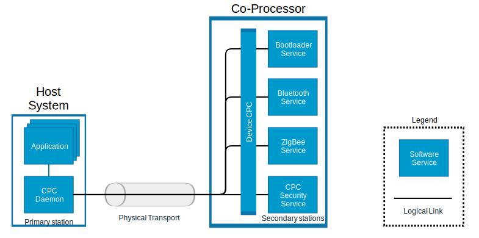

# Co-Processor Communication Daemon (CPCD)
## Overview
The Co-Processor Daemon (CPCD) enables users to have multiple stack protocols
interact with a secondary processor over a shared physical link using multiple endpoints.

CPCD is distributed as three components, the daemon binary `cpcd`, a library that
enables `C` applications to interact with the daemon and a configuration file.

In CPC, data transfers between processors are segmented in sequential packets.
Transfers are guaranteed to be error-free and sent in order.

Multiple applications can send or receive on the same endpoint without worrying about collisions.

A library `libcpc.so` is provided to simplify the interaction between the user application and the daemon.
Each API function of the library are documented in the `sl_cpc.h` header file.



## Compiling CPCd

Run the following commands

```
git clone https://github.com/SiliconLabs/cpc_daemon.git
cd cpc_daemon
mkdir build
cd build
cmake ../
make
```

## Installing CPCD and CPC library
To install the daemon, library and configuration file, run the following command:
```
sudo make install
sudo ldconfig
```

## Configuring and running CPCD
A configuration file must be provided to the CPC daemon. By default this configuration
file is installed under `/etc/cpcd.conf`. It is possible to change the location of the
configuration file by providing the `--conf` argument to `cpcd`.

```
cpcd --conf <configuration file path>
```

A description of each configuration can be found in `cpcd.conf`.

## Considerations
- The SPI driver uses a `sysfs` class GPIO as a chip select. Make sure the daemon has the proper permissions
- When reading, the user must provide a buffer big enough to receive the entire packet
- Tracing can be enabled in the daemon configuration file or when calling the lib `cpc_init`
